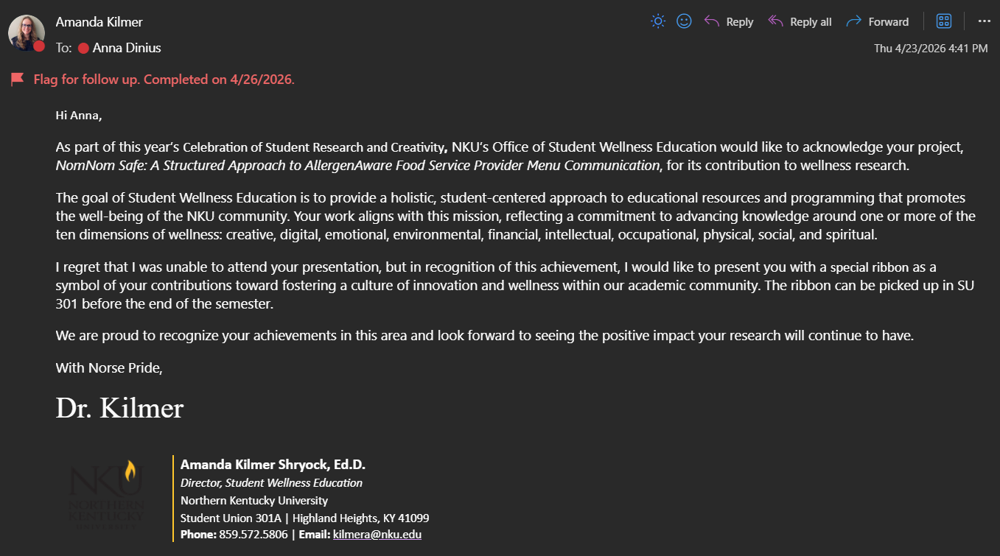
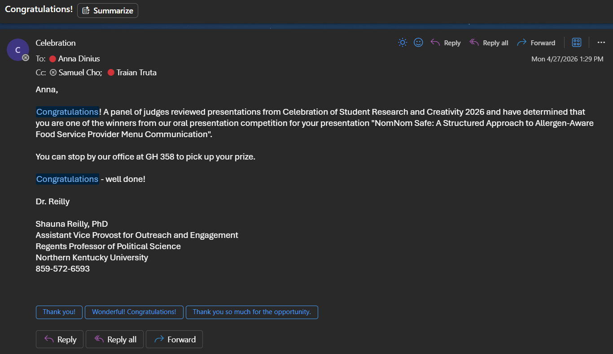

# Capstone Project: Final Presentation

## NomNom Safe

> Anna Dinius

---

## Problem Domain

Facilitating food service providers in their tracking, management, and communication of accurate and reliable allergen and dietary information so their customers can quickly and easily identify safe businesses and menu items while reducing health risks

---

## Solution Domain

A **2-sided web-app** that streamlines the management and sharing of allergen and other dietary information

- **Business side** - provides workflows for staff to upload and manage allergen and dietary information for their business and their menu items to the level of detail that fits their needs
- **User side** - provides workflows for the business's customers to search and filter the business data to locate businesses and menu items that are safe for them to eat based on their allergen(s) and/or other dietary restriction(s)

---

## Technology Stack

> For more details, see [`tech-stack.pdf`](https://github.com/Nomnom-Safe/User-Side/blob/main/docs/tech-stack.pdf) on GitHub

Full-stack web app tech stack:

- Database: Cloud Firestore
- Authentication: Firebase Authentication
- Business side:
  - Frontend: React, SCSS, Bootstrap
  - Backend: Node.js, express
- User side: Flutter, Dart

---

## Challenges and Changes

### Sprint 1

- Severely underestimated the size of my features

### Sprint 2

- Significant personal life events led to change in direction
- Original direction:
  - Conduct user testing with Business Side & make app revisions
- Updated direction:
  - Prepare User Side for demonstration

---

## Sprint 1 Timeline

### Focus: Business Side

- **Week 4:** switched backend to be compatible with the Firebase database
- **Week 5:** refactored the backend using SW Design Patterns and principles
- **Week 6:** refactored the frontend auth & account flows using SW Design Patterns & principles & improved navigation
- **Week 7:** implemented responsive design throughout the app & cleaned up stylesheets

---

## Sprint 2 Timeline

### Focus: User Side

- **Week 10:** used AI to collect information on the most effective testing strategies for web applications
- **Week 11:** consolidated testing strategy info form week 10 & used AI to analyze the best method combinations
- **Week 12:** break due to personal life events
- **Week 13:** fixed up app for Celebration demo
- **Week 14:** continued fixing up app for Celebration demo
- **Week 15:** prepared & gave presentation at Celebration

---

## Week 13: Closer Look

> For more details, see [`demo-preparation.md`](https://github.com/Nomnom-Safe/User-Side/blob/main/docs/demo_preparation.md) on GitHub

### User Side Progress:

- Fixed edge cases
- Fixed errors and bugs
- Fixed MCP access
- Audited Firestore collections
- Updated models to match schema changes

---

## Week 14: Closer Look

> For more details, see [`demo-preparation.md`](https://github.com/Nomnom-Safe/User-Side/blob/main/docs/demo_preparation.md) on GitHub

### User Side Progress:

- Improved UI consistency
- Standardized user feedback
- Cleaned up code

---

## Burndown Rate: 100%

- Milestones: [`milestones.pdf`](https://github.com/Nomnom-Safe/User-Side/blob/main/docs/Progress%20Reports/Spring%202026/sprint2/milestones.pdf)
- Requirements: [`requirements.md`](https://github.com/Nomnom-Safe/User-Side/blob/main/docs/Progress%20Reports/Spring%202026/sprint2/requirements.md)

---

## How I Used AI

- **Tools:** Copilot, Claude, ChatGPT, Gemini
- I used them as:
  - **Assistants** - I used them to assist in conducting research related to the app.
  - **Programmers** - I guided them in providing structured code for what I needed and double-checked their results before integrating them.
  - **Advisors** - I had them analyze the codebase and provide feedback on ways to improve the readability, maintainability, and extendability of the code.

---

## Project Statistics

| Section       | LOC        | File Count |
| ------------- | ---------- | ---------- |
| User Side     | 8,859      | 62         |
| Business Side | 15,850     | 191        |
| **Total**     | **24,709** | **253**    |

---

## Demonstrations

- User Side
  - [User side (recorded by me)](https://www.youtube.com/watch?v=kNBlxyRvvCs)
- Business Side
  - [Business side (recorded by Jeff)](https://youtu.be/MfqT1rB7Udw)

---

## What I Learned

- How to be more realistic with expectations and timelines
- How to use AI more effectively
  - Refining prompts
  - Providing adequate context
  - Specifying desired output format
  - Verifying output

---

## Publication

- Public presentation at the **Celebration of Student Research and Creativity**
  - Thursday, May 23
    - 11 am - 12 pm
    - 12-minute presentation
  - [PowerPoint slide deck](https://github.com/Nomnom-Safe/portfolio/blob/main/assets/celebration-presentation/dinius-anna-presentation.pdf)
    - Demonstration videos
  - [Celebration program booklet with project abstract on page 8](https://github.com/Nomnom-Safe/portfolio/blob/main/assets/celebration-program-booklet-2026.pdf)
- Public portfolio available on my [GitHub.io page](https://nomnom-safe.github.io/portfolio/)

---

## Celebration Results

---

## Celebration Results (continued)

---

## GitHub Repo Links

- [Business Side](https://github.com/Nomnom-Safe/Business-Side/tree/main)
- [User Side](https://github.com/Nomnom-Safe/User-Side/tree/main)
- [Portfolio](https://github.com/Nomnom-Safe/portfolio/tree/main)
- [Learning with AI](https://github.com/jeffreyperdue/Learning-With-AI-ASE485/tree/main)

---

# Thank You

## Questions?
